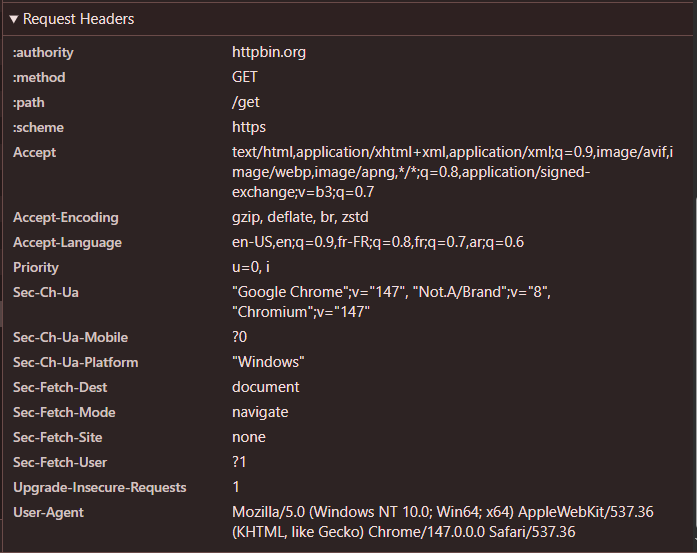

# TP 6 - Le Protocole HTTP

## TP1 : Exploration avec les DevTools

**Quel est le code de statut ?**
**Réponse :**

**Quels headers de requête sont envoyés ?**
**Réponse :**

**Quel est le Content-Type de la réponse ?**
**Réponse :**

## TP2 : Maîtrise de cURL

## TP3 : API REST avec JavaScript

## TP4 : Analyse des Headers de Sécurité

## TP5 : Cache HTTP

## Exercices Récapitulatifs
