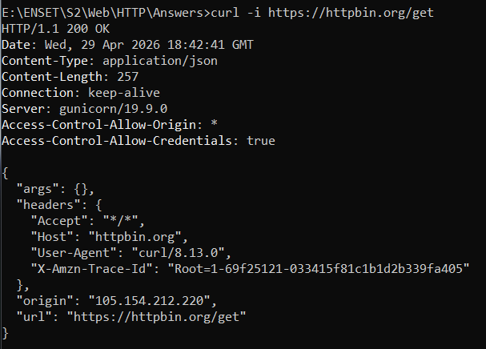

# TP 6 - Le Protocole HTTP

## TP1 : Exploration avec les DevTools

### Réponses des Questions :

- Quel est le code de statut ?

  Réponse : 200

- Quels headers de requête sont envoyés ?

  Réponse : Accept, User-Agent, Accept-Language...

- Quel est le Content-Type de la réponse ?

  Réponse : application/json

### Exercice :

| URL                    | Méthode | Code | Content-Type             |
| ---------------------- | ------- | ---- | ------------------------ |
| httpbin.org/get        | GET     | 200  | application/json         |
| httpbin.org/post       | POST    | 200  | application/json         |
| httpbin.org/status/201 | GET     | 201  | text/html; charset=utf-8 |

## TP2 : Maîtrise de cURL

### 2.1 Réponse :

- Quelle est la différence entre -i et -v ?

  Réponse :

  
  - `-i` : affiche les headers de réponse + le
    corps

  
  - `-v` : affiche tout (connexion, headers requête >, headers réponse <, corps)
    - Les lignes avec > = ce qu'on envoie
    - Les lignes avec < = ce qu'on reçoit
    - Les lignes avec \* = infos de connexion

## TP3 : API REST avec JavaScript

## TP4 : Analyse des Headers de Sécurité

## TP5 : Cache HTTP

## Exercices Récapitulatifs
