# TP 6 - Le Protocole HTTP

## TP1 : Exploration avec les DevTools

### 1.1 Ouvrir les DevTools

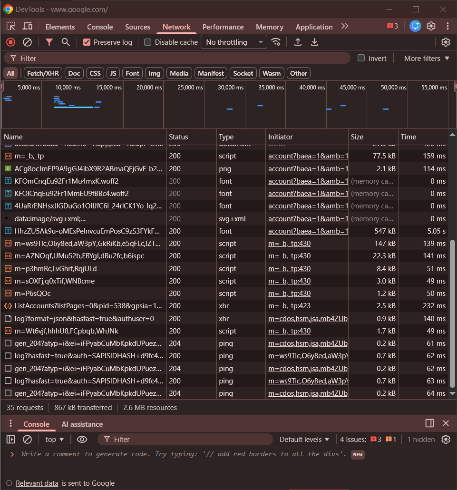

### 1.2 Observer une requête simple

- Quel est le code de statut ?

  

  Réponse : 200

- Quels headers de requête sont envoyés ?

  

  Réponse : Accept, User-Agent, Accept-Language...

- Quel est le Content-Type de la réponse ?

  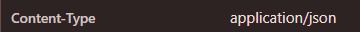

  Réponse : application/json

### 1.3 Tester différentes méthodes

```
// GET
fetch('https://httpbin.org/get')
  .then(r => r.json())
  .then(console.log);
```


```
// POST
fetch('https://httpbin.org/post', {
  method: 'POST',
  headers: {'Content-Type': 'application/json'},
  body: JSON.stringify({name: 'John', age: 30})
})
  .then(r => r.json())
  .then(console.log);
```

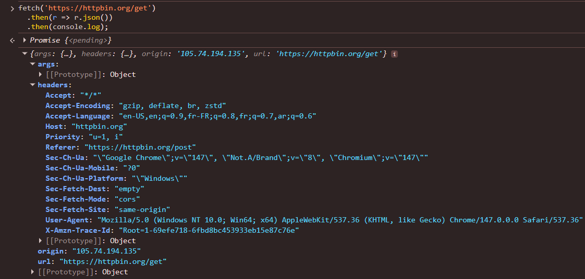

### 1.4 Observer les codes de statut

#### Exercice :

| URL                    | Méthode | Code | Content-Type             |
| ---------------------- | ------- | ---- | ------------------------ |
| httpbin.org/get        | GET     | 200  | application/json         |
| httpbin.org/post       | POST    | 200  | application/json         |
| httpbin.org/status/201 | GET     | 201  | text/html; charset=utf-8 |

## TP2 : Maîtrise de cURL

### 2.1 Requête GET simple

- Quelle est la différence entre -i et -v ?

  Réponse :

  
  - `-i` : affiche les headers de réponse + le
    corps

  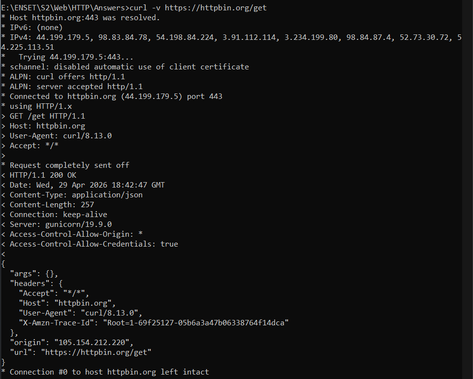
  - `-v` : affiche tout (connexion, headers requête >, headers réponse <, corps)
    - Les lignes avec > = ce qu'on envoie
    - Les lignes avec < = ce qu'on reçoit
    - Les lignes avec \* = infos de connexion

### 2.2 Requête POST avec données

```
# Form data
curl -X POST -d "name=John&email=john@example.com" \
  https://httpbin.org/post
```

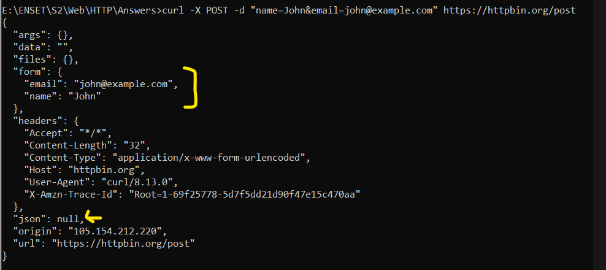

- Les données arrivent dans _form_, le champ _json_ est null.
  C'est le format des vieux formulaires HTML (_<form action="...">_). Les données sont encodées comme _clé=valeur&clé2=valeur2_ .

```
# JSON
curl -X POST \
  -H "Content-Type: application/json" \
  -d '{"name": "John", "email": "john@example.com"}' \
  https://httpbin.org/post
```

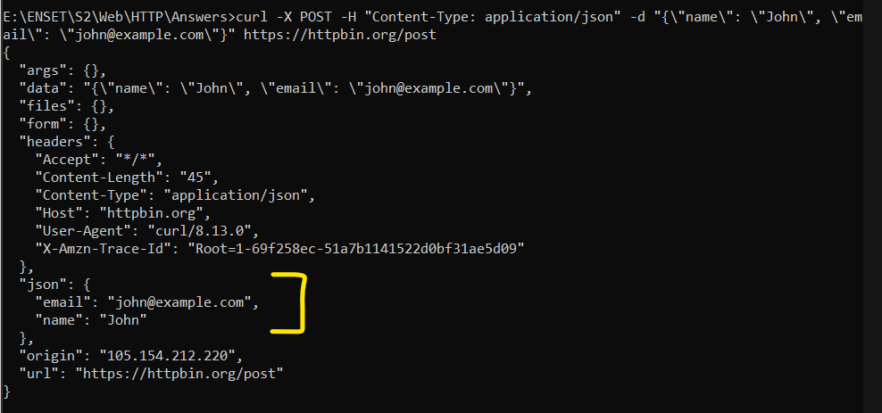

- Form data : données dans "form", Content-Type: application/x-www-form-urlencoded
- JSON : données dans "json", Content-Type: application/json
- La différence = le format d'encodage des données envoyées

### 2.3 Headers personnalisés

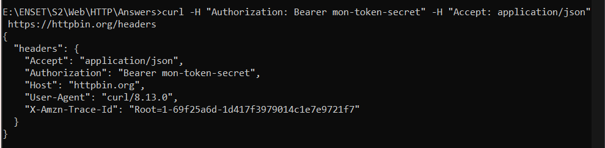

- on ajoute nos propres headers à la requête. -H permet d'ajouter un header.

### 2.4 Suivre les redirections

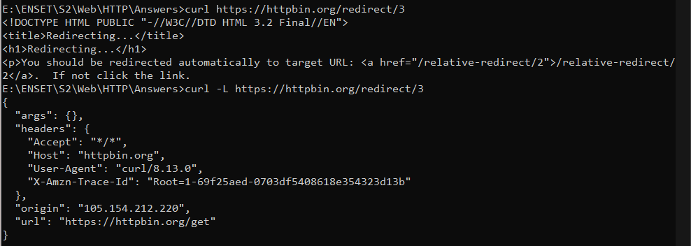

- Sans -L : cURL s'arrête à la redirection (affiche le HTML 302)
- Avec -L : cURL suit toutes les redirections jusqu'à la destination finale

### 2.5 Télécharger un fichier

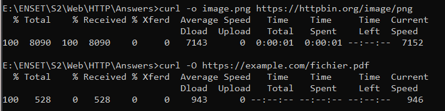

- o nom.ext : on peut choisir le nom du fichier
- O : le fichier garde son nom original de l'URL

### Exercice avancé

```
curl -X POST -H "Content-Type: application/json" \
-H "X-Custom-Header: MonHeader" \
-d "{\"action\": \"test\", \"value\": 42}" \
-i https://httpbin.org/post
```

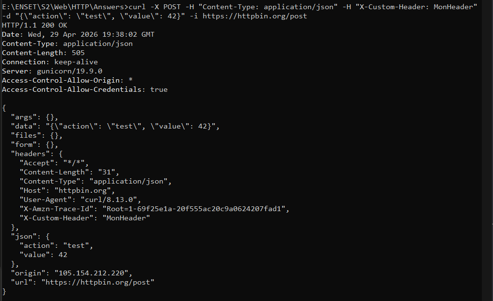

## TP3 : API REST avec JavaScript

### 3.1 GET basique

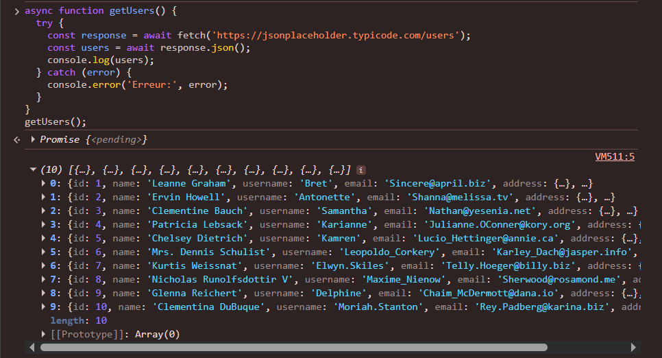

- _fetch(url)_ : envoie la requête GET
- _await_ : attend la réponse avant de continuer
- _response.json()_ : convertit la réponse en objet JS
- _try/catch_ : si ça plante, on attrape l'erreur

### 3.2 POST - Créer une ressource

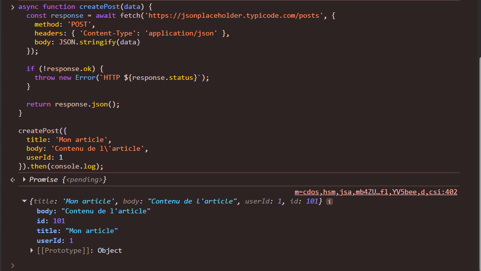

- _method: 'POST'_ : on crée une nouvelle ressource
- _headers Content-Type: application/json_ : on dit au serveur qu'on envoie du JSON
- _body: JSON.stringify(data)_ : on convertit l'objet JS en texte JSON
- _response.ok_ : vérifie que le status est entre 200-299
- Le serveur répond avec l'objet créé + id: 101 généré automatiquement

### 3.3 PUT - Modifier une ressource

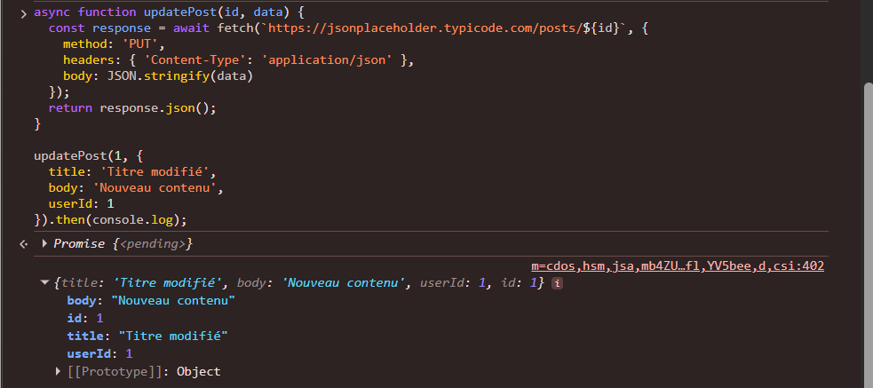

- on modifie entièrement l'article avec _id: 1_. _PUT_ = remplace tout l'objet.

### 3.4 DELETE - Supprimer une ressource

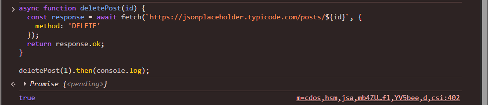

- method: _'DELETE'_ : on supprime la ressource avec id: 1
- _response.ok_ retourne true si status 200-299, suppression réussie
- Remarque (_.then(console.log);_) : j'ai l'ajouté jsut pour voir le résultat dans la console.

### Exercice pratique

```
async function fetchWithRetry(url, options, maxRetries) {
    for (let i = 1; i <= maxRetries; i++){
        const response = await fetch(url, options);
        if (response.status >= 500){
            await new Promise(resolve => setTimeout(resolve, 1000));
            continue;
        } else {
            return response;
        }
    }
    throw new Error (`Échec après ${maxRetries} tentatives`);
}
```

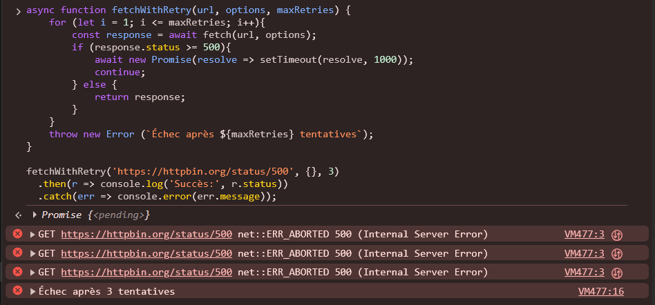

## TP4 : Analyse des Headers de Sécurité

### 4.1 Vérifier les headers d'un site

### + 4.2 Analyser avec Security Headers

google.com
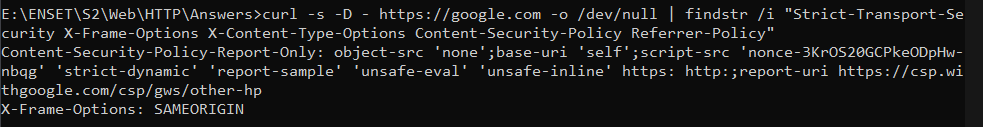

github.com
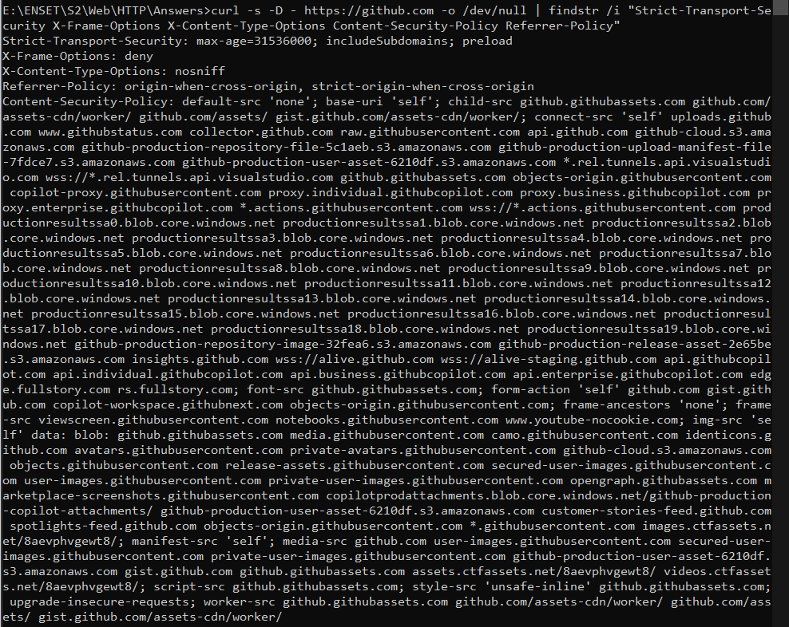

youtube.com
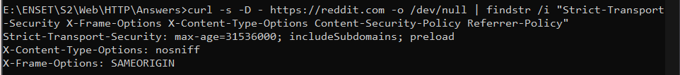

### Exercice

| Site        | HSTS                                               | X-Frame          | CSP               | Note               |
| ----------- | -------------------------------------------------- | ---------------- | ----------------- | ------------------ |
| github.com  | ✅(_max-age=31536000; includeSubdomains; preload_) | ✅(_deny_)       | ✅ présent        | Très bien sécurisé |
| google.com  | ❌absent                                           | ✅(_SAMEORIGIN_) | ⚠️(_Report-Only_) | Sécurité moyenne   |
| youtube.com | ✅(_max-age=31536000; includeSubDomains; preload_) | ✅(_SAMEORIGIN_) | ✅ présent        | Très bien sécurisé |

- Remarques:
  - _Report-Only_ : la règle est en mode observation. Elle ne bloque rien, mais elle enregistre tout ce qu'elle aurait bloqué et l'envoie aux développeurs.
  - Différence _deny_ vs _SAMEORIGIN_ pour _X-Frame_ :
    - _deny_ : personne ne peut mettre le site dans une iframe
    - _SAMEORIGIN_ : seulement le même site peut le faire

## TP5 : Cache HTTP

### 5.1 Observer le cache

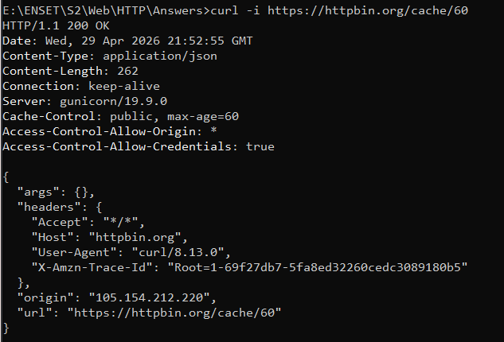

- _Cache-Control_ : ✅ public, max-age=60
- _ETag_ : absent
- _Expires_ : absent

### 5.2 Requête conditionnelle

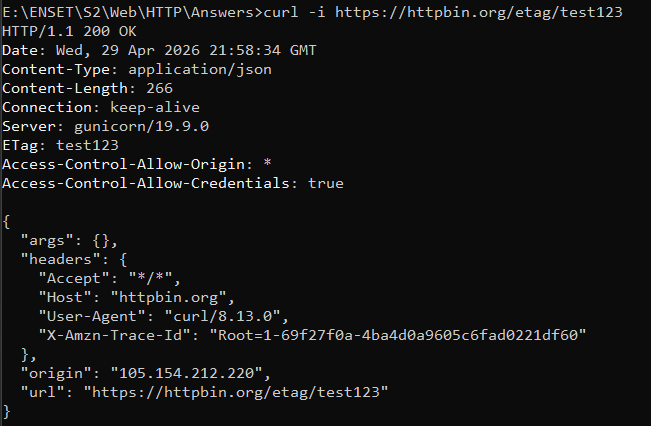

- _Cache-Control_ : absent
- _ETag_ : ✅ test123
- _Expires_ : absent

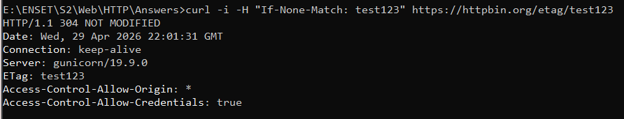

- _Cache-Control_ : absent
- _ETag_ : ✅ test123
- _Expires_ : absent
- _Code_ : ✅ 304 NOT MODIFIED

### 5.3 Simulation de cache dans le navigateur

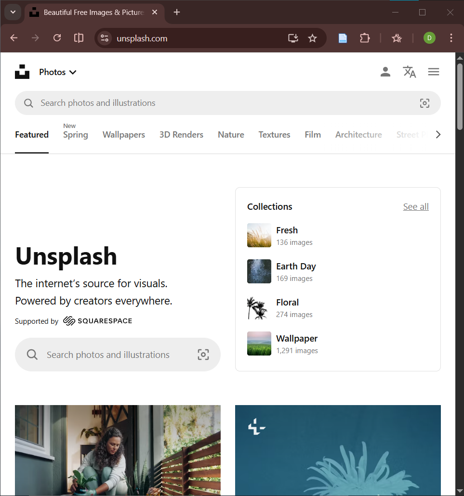

1ère visite (normal)
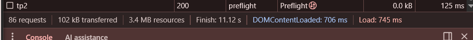

F5 (avec cache)
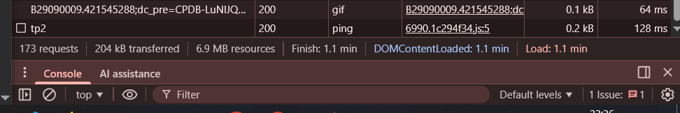

Ctrl+Shift+R (sans cache)
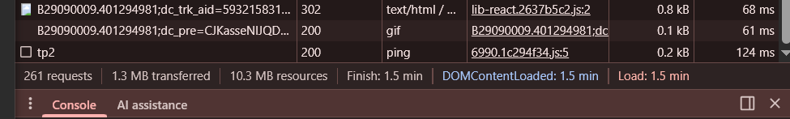

- F5 : 204 kB transférés → cache utilisé
- Ctrl+Shift+R : 1.3 MB transférés → tout re-téléchargé
- Économie grâce au cache : ~1.1 MB par rechargement

### Exercice

```
<!DOCTYPE html>
<html lang="fr">
<head>
  <meta charset="UTF-8">
  <title>Cache HTTP</title>
  <link rel="stylesheet" href="style.css">
</head>
<body>
  <h1>Test du Cache HTTP</h1>
  
  <script src="app.js"></script>
</body>
</html>
```

- _image.jpg_ : Cache-Control: public, max-age=31536000 (1 an)
- _style.css_ : Cache-Control: public, max-age=604800 (1 semaine)
- _app.js_ : Cache-Control: public, max-age=3600 (1 heure)

## Exercices Récapitulatifs

### Exercice 1 : Client HTTP minimaliste

- Ce client HTTP a été réalisé dans le TP précédent.

```
<!doctype html>
<html lang="en">
  <head>
    <meta charset="UTF-8" />
    <meta name="viewport" content="width=device-width, initial-scale=1.0" />
    <title>Exercice 1</title>
    <style>
      * {
        box-sizing: border-box;
        margin: 0;
        padding: 0;
      }

      body {
        background: #f5f5f5;
        font-family: Arial, sans-serif;
        font-size: 14px;
        padding: 30px;
        color: #222;
      }

      .container {
        background: white;
        border: 2px solid #ccc;
        border-radius: 10px;
        padding: 20px;
        max-width: 800px;
        margin: auto;
      }

      .row {
        display: flex;
        gap: 10px;
        align-items: center;
        margin-bottom: 14px;
      }

      select,
      input[type="text"],
      textarea {
        border: 2px solid #aaa;
        border-radius: 8px;
        padding: 8px 12px;
        font-size: 14px;
        font-family: Arial, sans-serif;
        outline: none;
        background: white;
        color: #222;
      }

      select:focus,
      input[type="text"]:focus,
      textarea:focus {
        border-color: #666;
      }

      #method {
        width: 110px;
        cursor: pointer;
      }
      #url {
        flex: 1;
      }

      button.send {
        background: white;
        border: 2px solid #aaa;
        border-radius: 8px;
        padding: 8px 20px;
        font-size: 14px;
        cursor: pointer;
      }

      button.send:hover {
        background: #f0f0f0;
      }

      #headers-list {
        display: flex;
        flex-direction: column;
        gap: 8px;
        margin-bottom: 8px;
      }

      .header-row {
        display: flex;
        gap: 10px;
        align-items: center;
      }

      .header-row input {
        flex: 1;
      }

      button.add-btn,
      button.remove-btn {
        background: white;
        border: 2px solid #aaa;
        border-radius: 8px;
        width: 34px;
        height: 34px;
        font-size: 18px;
        cursor: pointer;
        display: flex;
        align-items: center;
        justify-content: center;
        flex-shrink: 0;
      }

      button.add-btn:hover,
      button.remove-btn:hover {
        background: #f0f0f0;
      }

      #body {
        width: 100%;
        min-height: 120px;
        resize: vertical;
        margin-bottom: 14px;
      }

      hr {
        border: none;
        border-top: 2px solid #ccc;
        margin: 16px 0;
      }

      #response_body {
        width: 100%;
        min-height: 120px;
        resize: vertical;
        background: #fafafa;
        color: #333;
      }
    </style>
  </head>
  <body>
    <div class="row">
      <select id="method">
        <option>GET</option>
        <option>POST</option>
        <option>PUT</option>
        <option>PATCH</option>
        <option>DELETE</option>
        <option>HEAD</option>
      </select>
      <input type="text" id="url" placeholder="URL" />
      <button class="send" onclick="sendRequest()">Envoyer</button>
    </div>

    <div id="headers-list">
      <div class="header-row">
        <input type="text" placeholder="Header key" />
        <input type="text" placeholder="Header value" />
        <button class="add-btn" onclick="addHeader()">+</button>
      </div>
    </div>

    <textarea id="body" placeholder="body"></textarea>

    <hr />

    <textarea
      id="response_body"
      placeholder="Response body"
      readonly
    ></textarea>
  </body>

  <script>
    function sendRequest() {
      const method = document.getElementById("method").value;
      const url = document.getElementById("url").value;
      const body = document.getElementById("body").value;

      const headers = {};
      document.querySelectorAll(".header-row").forEach((row) => {
        const inputs = row.querySelectorAll("input");
        const key = inputs[0].value.trim();
        const value = inputs[1].value.trim();
        if (key) headers[key] = value;
      });
      if (!headers["Content-Type"]) {
        headers["Content-Type"] = "application/json";
      }

      fetch(url, {
        method: method,
        headers: headers,
        body: method !== "GET" ? body : null,
      })
        .then((response) => response.text())
        .then((text) => {
          document.getElementById("response_body").innerText = text;
        });
    }

    function addHeader() {
      const list = document.getElementById("headers-list");
      const row = document.createElement("div");
      row.className = "header-row";
      row.innerHTML = `
    <input type="text" placeholder="Header key" />
    <input type="text" placeholder="Header value" />
    <button class="remove-btn" onclick="this.closest('.header-row').remove()">−</button>
  `;
      list.appendChild(row);
    }
  </script>
</html>
```

### Exercice 2 : Questions théoriques

#### Q1:

- no-cache : sauvegarde en cache MAIS vérifie avec le serveur avant d'utiliser
- no-store : ne sauvegarde RIEN du tout (données sensibles comme banque)

#### Q2:

- POST /users → chaque appel crée UN NOUVEL utilisateur avec un nouvel id

#### Q3:

301 = Moved Permanently = "cette page a changé d'adresse pour toujours"

- Le navigateur est redirigé vers la nouvelle URL automatiquement
- Il mémorise la nouvelle adresse pour toujours

#### Q4:

- Origin indique d'où vient la requête (quel site l'a envoyée)

#### Q5:

Sans HttpOnly → JavaScript peut lire le cookie → un hacker peut voler
ta session avec document.cookie (attaque XSS)

Avec HttpOnly → JavaScript NE PEUT PAS lire le cookie
→ même si un script malveillant s'injecte dans la page,
il ne peut pas voler le cookie de session
